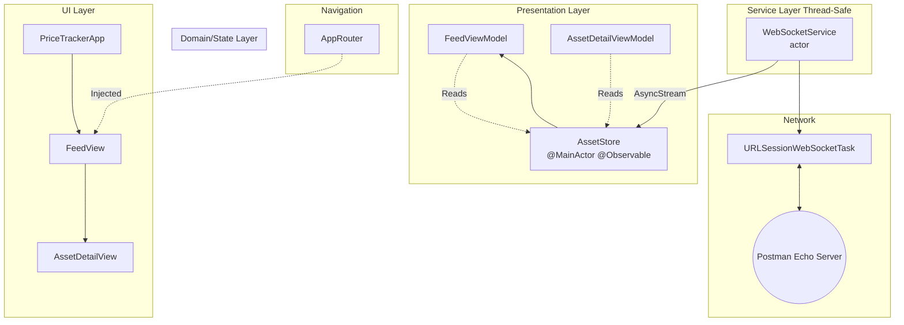

# Real-Time Price Tracker

A highly responsive, real-time iOS application that tracks live asset prices. Built to demonstrate modern Swift architecture, strict concurrency, and unidirectional data flow.

    
    
    

## 📱 Requirements & Assumptions

* **Minimum iOS Version:** iOS 17.0+
* **Xcode:** 16.0+ (Swift 6 Language Mode)
* **Assumption:** This project relies heavily on the `Observation` framework (`@Observable`), `AsyncStream`, and Swift 6 `Actor` isolation. These APIs mandate a minimum target of iOS 17.

## 🏗 Architecture

This app utilizes a **MVVM + Router** architecture, completely decoupling the UI, navigation, business logic, and network layers.

1. **Routing Layer (`AppRouter`):** Manages the `NavigationPath` centrally, allowing deep-link interception (`pricetracker://symbol/{symbol}`) without polluting View code.
2. **UI Layer (SwiftUI Views):** 100% declarative. Views contain no business logic and rely entirely on ViewModels for formatted data.
3. **Domain Layer (`AssetStore` / ViewModels):** An `@Observable @MainActor` store acts as the single source of truth. It manages the background tasks and ping loops.
4. **Service Layer (`WebSocketService`):** An `actor` that safely encapsulates the `URLSessionWebSocketTask`. It guarantees mutually exclusive access to network state and bridges data to the UI using `AsyncStream`.

## ⚡️ Key Tradeoffs & Decisions

* **Immutable Structs vs. Mutable Classes:** Instead of mutating prices on `@Observable` class references, the `Asset` model is an immutable `struct`. When a price updates, a brand new struct is generated. **Tradeoff:** Slightly more CPU allocations. **Benefit:** Bypasses ARC overhead, completely eliminates data races, and allows SwiftUI's diffing engine to animate list reordering flawlessly.
* **AsyncStream vs. Callbacks/Combine:** We used `AsyncStream` to bridge the background Actor to the MainActor Store. **Tradeoff:** Requires careful `Task` lifecycle management to prevent memory leaks. **Benefit:** Native full-duplex communication without the heavy dependency of the Combine framework, adhering strictly to Swift 6 Concurrency rules.
* **Client-Side Ping Loop:** The server given in the brief didn't work. **Tradeoff:** Used a public working websocket server.

## 🛠 Features

* Live full-duplex WebSocket integration.
* Dynamic sorting (highest prices float to the top).
* 1-second UI flash animations for price trends (Green = Up, Red = Down).
* Robust error handling (survives bad JSON and dropped TCP sockets).
* Full Dark/Light mode support.
* Deep Linking support (`pricetracker://symbol/AAPL`).
* Unit and UI tests

## 🧩🧩 Components diagram

