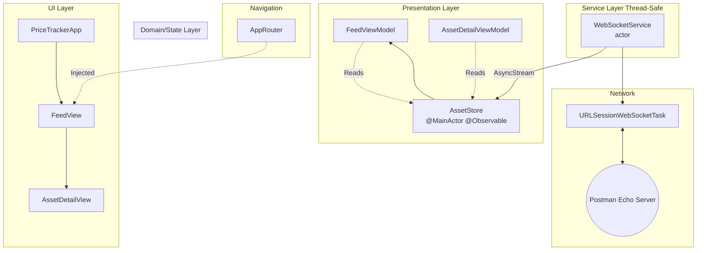

# Implementation notes
For this simple app I used AI-assisted coding tools, always trying to apply my critical thinking to what the AI was outputting. I guided the architectural decisions, implementation details and optimizations.

# Real-Time Price Tracker

A highly responsive, real-time iOS application that tracks live asset prices. Built to demonstrate modern Swift architecture, strict concurrency, and unidirectional data flow.

    
    
    

## 📱 Requirements & Assumptions

* **Minimum iOS Version:** iOS 17.0+
* **Xcode:** 16.0+ (Swift 6 Language Mode)
* **Assumption:** This project relies heavily on the `Observation` framework (`@Observable`), `AsyncStream`, and Swift 6 `Actor` isolation. These APIs mandate a minimum target of iOS 17.

## 🏗 Architecture

This app utilizes a **MVVM + Router** architecture, completely decoupling the UI, navigation, business logic, and network layers.

1. **Routing Layer (`AppRouter`):** Manages the `NavigationPath` centrally, allowing deep-link interception (`pricetracker://symbol/{symbol}`) without polluting View code.
2. **UI Layer (SwiftUI Views):** 100% declarative. Views contain no business logic and rely entirely on ViewModels for formatted data.
3. **Domain Layer (`AssetStore` / ViewModels):** An `@Observable @MainActor` store acts as the single source of truth. It manages the background tasks and ping loops. One store reference is shared for both Views, without duplicating connections. Instead of sending multiple requests to the server, we pack all symbol prices for which we need echo into one combiend json payload and send/receive only once. Being the exact receive timings and delays unknown, we commit updates to a dictionary and generate the correspondent sorted array at regular intervals (not at each single symbol price update) so the re-rendering triggered for SwiftUI is controllable.
4. **Service Layer (`WebSocketService`):** An `actor` that safely encapsulates the `URLSessionWebSocketTask`. It guarantees mutually exclusive access to network state and bridges data to the UI using `AsyncStream`.

## ⚡️ Key Tradeoffs & Decisions

* **AsyncStream vs. Callbacks/Combine:** We used `AsyncStream` to bridge the background Actor to the MainActor Store. **Tradeoff:** Requires careful `Task` lifecycle management to prevent memory leaks. **Benefit:** Native full-duplex communication without the heavy dependency of the Combine framework, adhering strictly to Swift 6 Concurrency rules.
* **Client-Side Ping Loop:** The server given in the brief didn't work. **Tradeoff:** Used a public working websocket server.

## 🛠 Features

* Live full-duplex WebSocket integration.
* Dynamic sorting (highest prices float to the top).
* 1-second UI flash animations for price trends (Green = Up, Red = Down).
* Robust error handling (survives bad JSON and dropped TCP sockets).
* Full Dark/Light mode support.
* Deep Linking support (`pricetracker://symbol/AAPL`).
* Unit and UI tests

## 🧩🧩 Components diagram

```mermaid
graph TD
    subgraph UI Layer
        App[PriceTrackerApp] --> FeedView[FeedView]
        FeedView --> Detail[AssetDetailView]
    end

    subgraph Navigation
        Router[AppRouter] -. "Injected" .-> FeedView
    end

    subgraph Presentation Layer
        FeedVM[FeedViewModel] -. "Reads" .-> Store
        DetailVM[AssetDetailViewModel] -. "Reads" .-> Store
    end

    subgraph Domain/State Layer
        Store[AssetStore <br> @MainActor @Observable]
        Store --> FeedVM
    end

    subgraph Service Layer Thread-Safe
        Service[WebSocketService <br> actor]
        Service -- "AsyncStream<AssetPriceUpdate>" --> Store
    end

    subgraph Network
        URLSession[URLSessionWebSocketTask] <--> Server((Postman Echo Server))
        Service --> URLSession
    end
```

